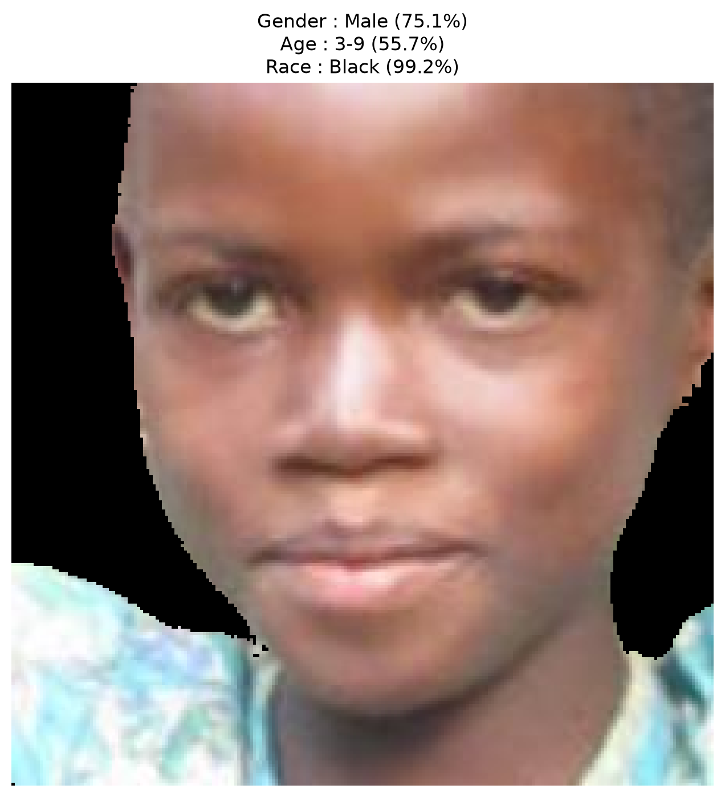
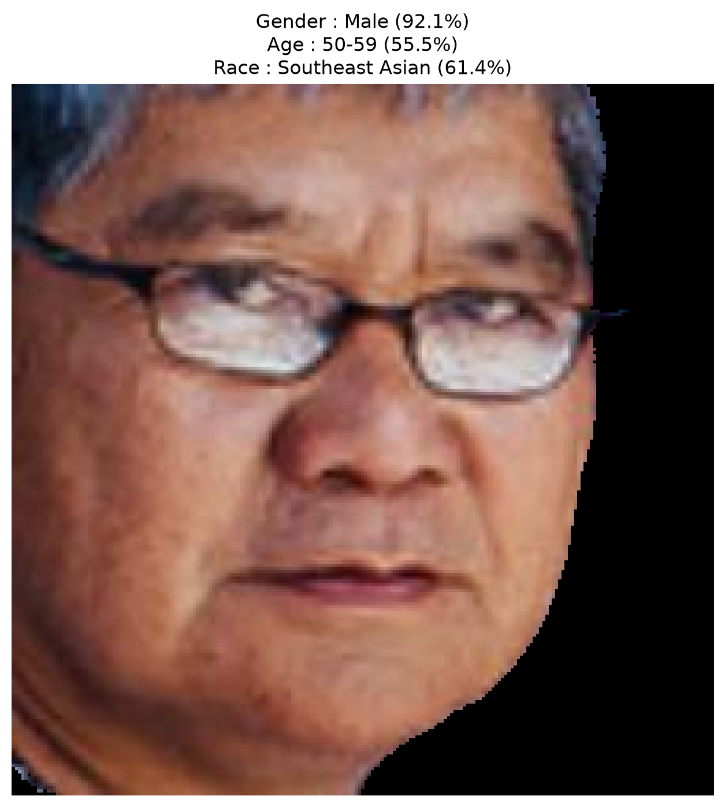
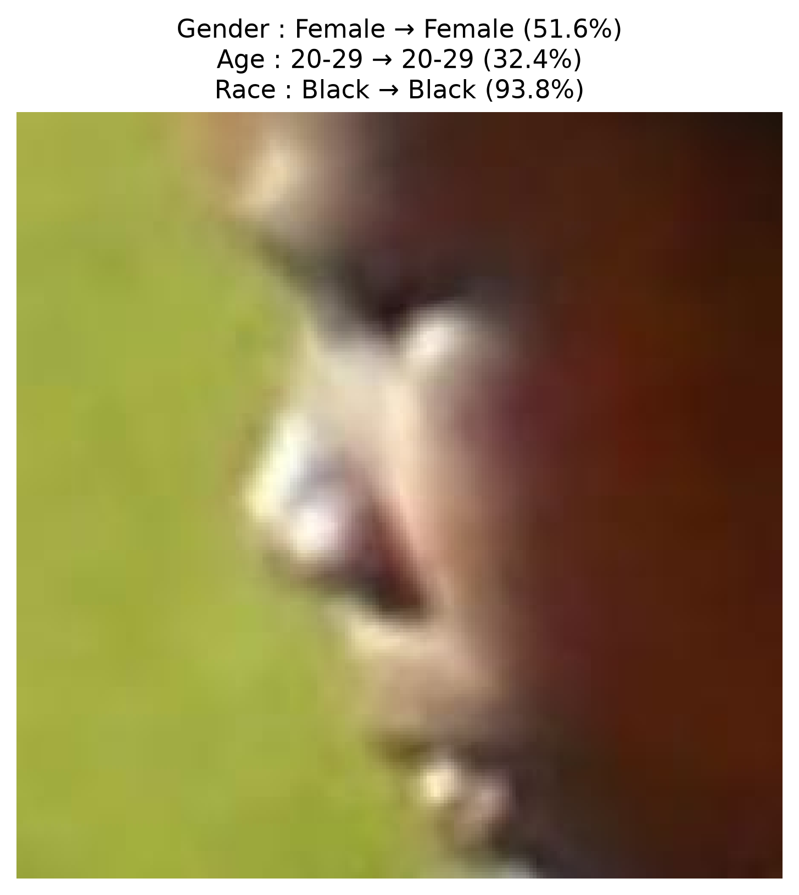
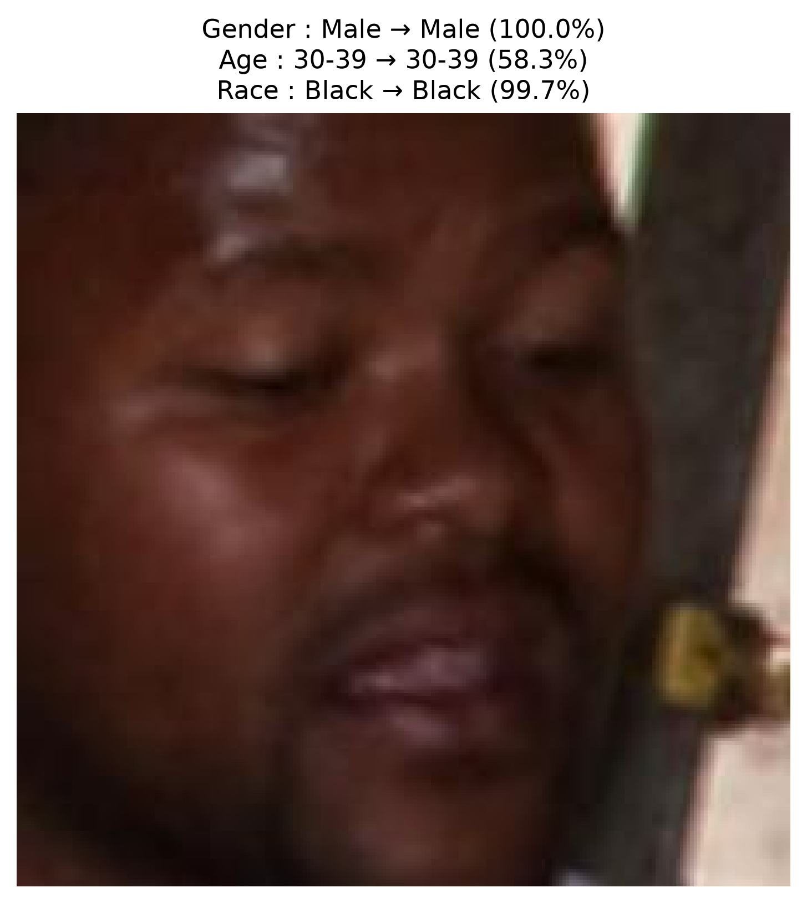
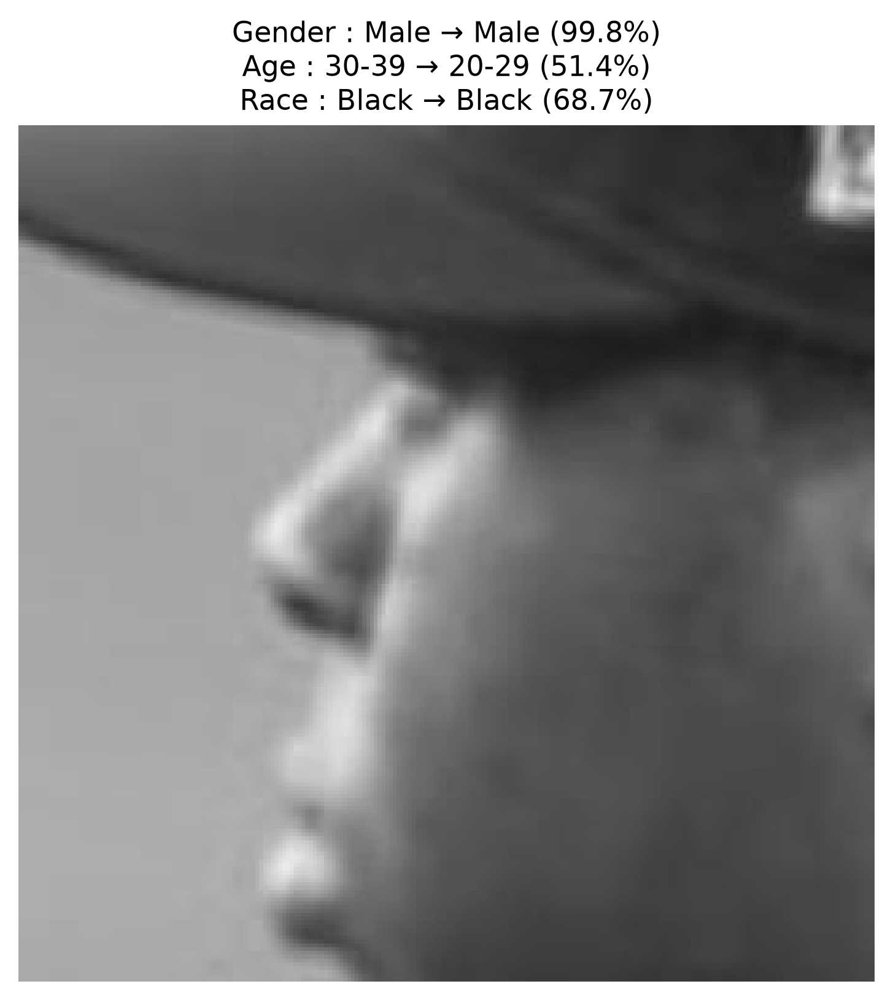

# Face Analyzer

> End-to-end multi-task facial attribute analysis using SAM2, Vision Transformers, and pretrained visual encoders.

Face Analyzer is a computer-vision pipeline for predicting three facial attributes from an input image:

- **Gender:** Male / Female
- **Age group:** 9 discrete age ranges
- **Race:** 7 FairFace-defined classes

The project combines **SAM2-based face segmentation**, a pretrained **Vision Transformer encoder**, a shared feature projection block, and three task-specific prediction heads. The implementation is designed around transfer learning: the pretrained vision encoder is frozen and the task-specific layers are trained on FairFace.

The repository also provides a practical inference application with three modes:

1. Single-image prediction
2. Real-time webcam prediction
3. Real-time webcam prediction with SAM2 face extraction

---

## Project goals

The project implements the main ideas required for a modern pretrained-vision pipeline:

- End-to-end image preprocessing and dataset loading
- Face segmentation with SAM2
- Background suppression using the selected face mask
- Feature extraction with a pretrained Vision Transformer
- Multi-task learning with three prediction heads
- Transfer learning with a frozen encoder
- Mixed-precision training on CUDA when available
- Validation and test evaluation
- Confusion matrices and classification reports
- Batch inference and CSV result export
- Interactive single-image and webcam prediction

The course specification for the project describes an end-to-end pipeline based on SAM, pretrained Vision Transformers, and three simultaneous prediction heads for age, gender, and race.

---

## Pipeline overview

```text
                           Input image
                               │
                               ▼
                    ┌────────────────────┐
                    │      SAM2          │
                    │ Automatic masks     │
                    └─────────┬──────────┘
                              │
                              ▼
                    Candidate face masks
                              │
                              ▼
                 CLIP semantic mask scoring
                              │
                              ▼
                    Best face mask selected
                              │
                              ▼
              Crop + zero background outside mask
                              │
                              ▼
                 Resize / encoder preprocessing
                              │
                              ▼
                    ┌────────────────────┐
                    │  Vision Encoder    │
                    │   CLIP ViT-B/32    │
                    │   (frozen)         │
                    └─────────┬──────────┘
                              │
                              ▼
                    Shared feature vector
                              │
                              ▼
                 Linear → BatchNorm → ReLU
                         → Dropout
                              │
                 ┌────────────┼────────────┐
                 ▼            ▼            ▼
          Gender Head     Age Head      Race Head
             1 logit       9 logits      7 logits
                 │            │            │
                 ▼            ▼            ▼
            Male/Female   9 age groups  7 race groups
```

The mandatory architecture in the project specification follows the same high-level structure: face segmentation, encoder feature extraction, and three simultaneous prediction heads.

---

## Dataset

The project uses **FairFace** as its labeled dataset. The official FairFace project describes the dataset as a face-attribute dataset covering race, gender, and age, and distributes it under **CC BY 4.0**. [Official FairFace repository](https://github.com/joojs/fairface)

### Labels used by this implementation

| Task | Number of classes | Classes |
|---|---:|---|
| Gender | 2 | Male, Female |
| Age | 9 | 0-2, 3-9, 10-19, 20-29, 30-39, 40-49, 50-59, 60-69, 70+ |
| Race | 7 | East Asian, Indian, Black, White, Middle Eastern, Latino/Hispanic, Southeast Asian |

These class definitions match the FairFace label organization used in the project.

### Dataset split implemented in the code

`main.py` loads the FairFace parquet data and creates the following split configuration:

| Split | Images | Source in code |
|---|---:|---|
| Train | 70,000 | First 70,000 samples from the train parquet data |
| Test | 16,744 | Remaining samples from the train parquet data |
| Validation | 10,954 | Separate validation parquet data |

The exported `test_result/predictions.csv` contains **16,744 test predictions**, which matches the test split produced by the data loader.

The project does **not** commit the original FairFace image dataset to the repository. Download/access the dataset separately and place the parquet files under `data/`.

---

## Model architecture

### 1. Face segmentation with SAM2

`segmentation/sam2_loader.py` uses the Hugging Face `mask-generation` pipeline with **`facebook/sam2.1-hiera-large`** to generate candidate masks. The official Hugging Face model page provides the same Transformers loading interface used by the project. [SAM2.1 Hiera Large](https://huggingface.co/facebook/sam2.1-hiera-large)

The segmentation stage:

1. Converts the input to RGB.
2. Generates automatic masks with SAM2.
3. Scores candidate masks using CLIP text-image similarity.
4. Selects the mask with the highest face-related semantic score.
5. Crops the selected region.
6. Sets pixels outside the mask to black.
7. Passes the resulting face image to the classifier.

`face_crop.py` also contains a geometry-based filtering function for candidate masks using area, size, aspect ratio, border contact, and distance from the image center. The current `select_face_mask()` path uses CLIP semantic scoring directly; the geometry filter is implemented but disabled in that function.

### 2. Vision encoder

The code provides a reusable `VisionEncoder` abstraction supporting:

- **CLIP**: `openai/clip-vit-base-patch32`
- **SigLIP**: `google/siglip-base-patch16-224`
- **DINOv2**: `facebook/dinov2-base`

The required/reporting path in the exported project uses **CLIP** as the trained encoder and freezes its weights.

Official model references:

- [OpenAI CLIP ViT-B/32](https://huggingface.co/openai/clip-vit-base-patch32)
- [Google SigLIP base patch16/224](https://huggingface.co/google/siglip-base-patch16-224)
- [Meta DINOv2 base](https://huggingface.co/facebook/dinov2-base)

### 3. Shared projection

The selected encoder representation is passed through:

```text
Linear(feature_dim → 512)
        ↓
BatchNorm1d(512)
        ↓
ReLU
        ↓
Dropout(0.3)
```

For the CLIP configuration, the encoder feature representation is projected to a shared **512-dimensional embedding** before being sent to the three task-specific heads.

### 4. Prediction heads

#### Gender head

A single linear layer produces one logit:

```text
512 → 1
```

Training loss:

```text
BCEWithLogitsLoss
```

Prediction uses a sigmoid threshold of `0.5`.

#### Age head

The age classifier uses a small two-layer MLP:

```text
512 → 512 → 9
```

with ReLU and dropout in the hidden layer.

Training loss:

```text
CrossEntropyLoss
```

#### Race head

The race classifier uses:

```text
512 → 7
```

with:

```text
CrossEntropyLoss
```

At inference time, softmax probabilities are used for both the age and race heads.

---

## Training strategy

The main training configuration is defined in `segmentation/train.py` and `segmentation/trainer.py`.

| Parameter | Value |
|---|---|
| Encoder | CLIP ViT-B/32 |
| Encoder frozen | Yes |
| Projection dimension | 512 |
| Batch size | 16 |
| DataLoader workers | 4 |
| Epochs | 20 maximum |
| Optimizer | AdamW |
| Learning rate | `1e-4` |
| Weight decay | `1e-4` |
| Gender loss weight | 1.0 |
| Age loss weight | 1.0 |
| Race loss weight | 1.0 |
| Scheduler | ReduceLROnPlateau |
| Scheduler factor | 0.5 |
| Scheduler patience | 2 |
| Early stopping patience | 5 |
| Mixed precision | Enabled when CUDA is available |

The total multi-task loss is:

```text
L = L_gender + L_age + L_race
```

where the three loss terms are weighted by the corresponding task weights.

The training loop stores:

- total training loss
- validation loss
- individual task losses
- gender accuracy
- age accuracy
- race accuracy
- learning rate

The best model is selected using validation loss and stored as `best_model.pt`; the final model is stored as `last_model.pt`.

---

## Repository structure

```text
Face_Analyzer/
├── .gitignore
├── LICENSE
├── README.md
├── main.py
├── requirements.txt
├── samples/
│   ├── sample_10374.png
│   ├── sample_7554.png
│   └── sample_8769.png
│
├── segmented_samples/
│   ├── Segmented_prediction1.png
│   └── Segmented_prediction2.png
│
└── segmentation/
    ├── CLIP_Head.py
    ├── dataset.py
    ├── encoder.py
    ├── face_crop.py
    ├── fairface_dataset.py
    ├── heads.py
    ├── multitask_model.py
    ├── preproccess_dataset.py
    ├── predict.py
    ├── sam2_loader.py
    ├── test.py
    ├── test_plot.py
    ├── train.py
    ├── train_plot.py
    ├── trainer.py
    ├── validation.py
    ├── validations_plots.py
    │
    ├── labels/
    │   ├── train.csv
    │   ├── validation.csv
    │   └── test.csv
    │
    ├── logs/
    │   ├── train_log.csv
    │   ├── validation_log.csv
    │   └── test_log.csv
    │
    ├── processed_faces/
    │   ├── train/
    │   ├── validation/
    │   └── test/
    │
    ├── results/
    │   ├── 000002_prediction.png
    │   ├── 000019_prediction.png
    │   └── 000064_prediction.png
    │
    ├── test_result/
    │   ├── predictions.csv
    │   ├── test_summary.csv
    │   ├── confusion_matrix_gender.csv
    │   ├── confusion_matrix_age.csv
    │   └── confusion_matrix_race.csv
    │
    └── validation_results/
        ├── validation_predictions.csv
        ├── classification_report.txt
        ├── gender_confusion_matrix.csv
        ├── age_confusion_matrix.csv
        ├── race_confusion_matrix.csv
        └── samples/
```

Model weights, raw parquet data, and generated training checkpoints are intentionally not embedded in the uploaded project archive.

---

## Installation

### 1. Clone the repository

```bash
git clone https://github.com/husseiny8/Face_Analyzer.git
cd Face_Analyzer
```

### 2. Create an environment

Create a clean Python environment suitable for the versions pinned in `requirements.txt`.

For example with `venv`:

```bash
python -m venv .venv
```

Activate it:

**Windows**

```powershell
.venv\Scripts\activate
```

**Linux / macOS**

```bash
source .venv/bin/activate
```

### 3. Install dependencies

```bash
pip install -r requirements.txt
```

> **Requirements-file note:** the `requirements.txt` included in the uploaded project is UTF-16 LE encoded. If your `pip` installation reports a file-encoding/requirements parsing error, convert that file to UTF-8 and install the converted file instead.

The repository is configured around PyTorch, Hugging Face Transformers, Datasets, OpenCV, Pillow, pandas, scikit-learn, and the other pinned packages listed in `requirements.txt`.

### 4. GPU recommendation

A CUDA-capable GPU is strongly recommended for SAM2 preprocessing and practical inference speed.

The project automatically selects:

```python
torch.device("cuda" if torch.cuda.is_available() else "cpu")
```

for the main model. The standalone `sam2_loader.py` configuration is explicitly CUDA-oriented, while `predict.py` contains CPU fallback behavior when loading the SAM2 pipeline.

---

## Model files and directory setup

The code expects pretrained models to be available locally using the following relative paths:

```text
Face_Analyzer/
├── models/
│   ├── clip-vit-base-patch32/
│   ├── siglip-base-patch16-224/
│   └── dinov2-base/
│
└── checkpoints/
    ├── sam2.1-hiera-large/
    └── ...
```

The trained project checkpoint is expected at:

```text
segmentation/checkpoints/best_model.pt
```

The uploaded ZIP does not contain these large model/checkpoint files, so they must be provided separately.

> **Practical note:** no trained checkpoint is stored in the supplied archive, even though the inference/evaluation scripts expect `segmentation/checkpoints/best_model.pt`. To reproduce the bundled benchmark outputs from scratch, train the model and generate the checkpoint first; to reproduce the included inference examples, provide the corresponding trained checkpoint locally.

---

## Preparing the dataset

Place the FairFace parquet files under:

```text
data/
├── train-*.parquet
└── validation-*.parquet
```

The top-level loader in `main.py` uses the parquet files directly and creates the train/test/validation split described above.

To inspect only whether the dataset loader works:

```bash
python main.py
```

---

## SAM2 preprocessing

The preprocessing pipeline is implemented in:

```text
segmentation/preproccess_dataset.py
```

and relies on:

```text
segmentation/sam2_loader.py
segmentation/face_crop.py
```

The preprocessing process stores:

- processed face images under `processed_faces/`
- successful labels under `labels/`
- processing status and timings under `logs/`

### Important reproducibility note

The current checked-in `preproccess_dataset.py` contains demonstration sampling lines that restrict each split to five examples before preprocessing:

```python
train_data = train_data.select(range(5))
validation_data = validation_data.select(range(5))
test_data = test_data.select(range(5))
```

The ZIP therefore contains only a small set of SAM2-processed example images and labels. For full-dataset preprocessing, remove those three `select(range(5))` calls before running the preprocessing script.

---

## Training

Training is launched from `segmentation/train.py`.

```bash
cd segmentation
python train.py
```

The program asks which training dataset should be used:

```text
1) Original FairFace Images
2) SAM2 Cropped Faces
```

Select `1` for the direct FairFace pipeline or `2` for the preprocessed SAM2 face images.

The trainer then:

1. Builds the selected dataset.
2. Creates DataLoaders.
3. Initializes the CLIP-based multi-task model.
4. Freezes the encoder.
5. Trains the projection and prediction heads.
6. Runs validation after every epoch.
7. Reduces the learning rate when validation loss plateaus.
8. Saves the best checkpoint.
9. Applies early stopping when validation loss stops improving.
10. Saves training history to CSV.

Expected generated files:

```text
segmentation/checkpoints/
├── best_model.pt
├── last_model.pt
└── history.csv
```

---

## Validation

The validation pipeline is implemented in:

```bash
cd segmentation
python validation.py
```

It loads the best checkpoint and evaluates the separate validation parquet split.

The generated validation artifacts include:

```text
validation_results/
├── validation_predictions.csv
├── classification_report.txt
├── gender_confusion_matrix.csv
├── age_confusion_matrix.csv
├── race_confusion_matrix.csv
└── samples/
```

The repository also contains `validations_plots.py`, which can generate accuracy, precision/recall, and confusion-matrix visualizations from these validation files.

---

## Test evaluation

Run:

```bash
cd segmentation
python test.py
```

The script asks whether to evaluate:

```text
1) Original FairFace Images
2) SAM2 Cropped Faces
```

The exported full test results in this repository contain **16,744 predictions**. These results correspond to the full test split produced from the original FairFace parquet data; the SAM2-processed dataset stored in the ZIP is a small example subset used to demonstrate the segmentation/preprocessing path.

Generated files:

```text
test_result/
├── predictions.csv
├── test_summary.csv
├── confusion_matrix_gender.csv
├── confusion_matrix_age.csv
└── confusion_matrix_race.csv
```

Use `test_plot.py` to turn those CSV results into visual plots.

---

## Quantitative results

The following numbers are taken directly from the exported result files in the project.

### Test-set accuracy

| Task | Accuracy |
|---|---:|
| Gender | **94.98%** |
| Age | **60.21%** |
| Race | **73.07%** |

### Validation-set accuracy

| Task | Accuracy |
|---|---:|
| Gender | **94.83%** |
| Age | **60.02%** |
| Race | **72.33%** |

### Validation macro F1

| Task | Macro F1 |
|---|---:|
| Gender | **94.81%** |
| Age | **58.03%** |
| Race | **72.01%** |

### Selected validation class-level metrics

#### Gender

| Class | Precision | Recall | F1 |
|---|---:|---:|---:|
| Male | 94.97% | 95.27% | 95.12% |
| Female | 94.67% | 94.34% | 94.51% |

#### Age

| Age group | Precision | Recall | F1 |
|---|---:|---:|---:|
| 0-2 | 75.36% | 78.39% | 76.85% |
| 3-9 | 78.98% | 84.51% | 81.65% |
| 10-19 | 58.98% | 40.05% | 47.71% |
| 20-29 | 64.30% | 72.48% | 68.15% |
| 30-39 | 50.43% | 52.70% | 51.54% |
| 40-49 | 49.41% | 43.09% | 46.03% |
| 50-59 | 51.08% | 47.74% | 49.35% |
| 60-69 | 51.58% | 50.78% | 51.18% |
| 70+ | 54.55% | 45.76% | 49.77% |

#### Race

| Class | Precision | Recall | F1 |
|---|---:|---:|---:|
| East Asian | 72.36% | 78.71% | 75.40% |
| Indian | 81.23% | 72.23% | 76.47% |
| Black | 89.39% | 87.15% | 88.25% |
| White | 78.05% | 76.07% | 77.05% |
| Middle Eastern | 64.46% | 67.66% | 66.02% |
| Latino/Hispanic | 56.35% | 57.67% | 57.00% |
| Southeast Asian | 63.29% | 64.45% | 63.87% |

### Interpretation

The strongest task in the exported results is **gender classification**, with about 95% accuracy on both validation and test data.

**Race classification** reaches roughly 72-73% accuracy, with the strongest validation F1 for the Black class and lower performance for the Latino/Hispanic and Middle Eastern classes.

**Age classification** is the most difficult of the three tasks. The class-level confusion matrix shows substantial overlap between neighboring adult age groups, which is consistent with the intrinsic difficulty of discrete age estimation from a single face image.

The validation and test confusion matrices in `validation_results/` and `test_result/` provide the most detailed view of these class interactions.

---

## Example predictions

### Segmented face prediction

The following examples are included in the repository and show the SAM2-based masked face output together with the three model predictions.

<p align="center">
  
  
</p>

### Validation / single-image outputs

The project also stores prediction visualizations containing the predicted class and confidence for each task.

<p align="center">
  
  
  
</p>

Examples included in the repository demonstrate both successful multi-task predictions and cases where the age prediction differs from the reference age group, illustrating why class-level metrics are important.

---

## Interactive inference application

The main user-facing inference script is:

```text
segmentation/predict.py
```

Run it with:

```bash
cd segmentation
python predict.py
```

A Tkinter menu provides three options.

### 1. Single Image Prediction

The application opens a file picker and accepts common image formats such as:

- JPG / JPEG
- PNG
- BMP
- TIFF
- WEBP

The result is displayed with:

```text
Gender + confidence
Age + confidence
Race + confidence
Inference time
```

and is saved under:

```text
segmentation/results/<image_name>_prediction.png
```

### 2. Real-Time Camera

The webcam mode:

- opens camera index `0`
- requests a 1280×720 frame size
- mirrors the frame
- performs periodic predictions
- overlays the predicted gender, age, race, confidence, inference time, and FPS

The main classifier is evaluated every three frames to reduce unnecessary inference load.

### 3. Real-Time Camera + SAM2

The SAM2 camera mode adds an explicit segmentation stage. Because SAM2 is substantially heavier than the classification model, it runs less frequently than the main prediction loop.

The implementation uses:

```text
Prediction interval: 3 frames
SAM2 interval:      30 frames
```

The UI also indicates whether a face is currently available from the SAM2 pipeline.

Press **Q** or **ESC** to exit the camera window.

---

## Zero-shot CLIP component

The project contains `segmentation/CLIP_Head.py` as a separate CLIP-based zero-shot prediction utility.

It defines textual prompts for:

- age
- gender
- race

and uses CLIP image-text similarity to select the highest-scoring class.

This component is also used conceptually by the SAM2 mask-selection stage: candidate segmented regions are compared against face-related text prompts, and the mask with the highest semantic score is selected.

---

## Plotting and analysis utilities

The repository includes dedicated scripts for turning the CSV outputs into figures.

### Training plots

```bash
python train_plot.py
```

Generates plots for:

- training vs. validation loss
- task-specific losses
- task accuracies
- learning rate

Expected output directory:

```text
results/train_plots/
```

### Test plots

```bash
python test_plot.py
```

Generates:

- overall test accuracy
- gender confusion matrix
- age confusion matrix
- race confusion matrix
- per-class age accuracy
- per-class race accuracy

Expected output directory:

```text
results/test_plots/
```

### Validation plots

```bash
python validations_plots.py
```

Generates:

- gender / age / race confusion matrices
- task accuracy comparison
- gender precision/recall/F1
- age precision/recall
- race precision/recall

Expected output directory:

```text
results/validation_plots/
```

---

## Reproducibility notes

For a clean reproduction, make sure the following paths exist before training or inference:

```text
models/clip-vit-base-patch32/
checkpoints/sam2.1-hiera-large/
segmentation/checkpoints/best_model.pt
```

and:

```text
data/train-*.parquet
data/validation-*.parquet
```

The code performs device selection automatically for the main classifier, but SAM2 is computationally expensive and GPU execution is recommended.

The repository stores result CSV files rather than the large raw dataset and model weight files. This keeps the Git repository practical while preserving the evaluation artifacts and example outputs.

---

## Important implementation notes

### Frozen encoder

The main training configuration uses a **frozen CLIP encoder**. Only the shared projection and task heads are optimized. This keeps the trainable portion small and follows the transfer-learning approach described in the project specification.

### Shared representation, separate tasks

The three tasks share the same projected visual embedding but have independent prediction heads. This allows common visual features to be reused while preserving task-specific classifiers.

### Classification rather than continuous age regression

The exported implementation treats age as a **9-class classification problem**. It does not implement continuous age regression in the current released code, so MAE/MSE/RMSE are not reported as continuous-age metrics in the included result files.

### Current reported encoder

The codebase exposes CLIP, SigLIP, and DINOv2 encoder classes, but the supplied benchmark artifacts (`test_result/` and `validation_results/`) correspond to the CLIP-based configuration. No separate SigLIP/DINOv2 benchmark tables are included in the uploaded project archive, so this README does not claim comparative numerical results for those encoders.

---

## Limitations and responsible use

This project is an educational research implementation, not a production-grade identity or demographic assessment system.

The predictions are model estimates over FairFace-defined categories and can be affected by image quality, pose, occlusion, lighting, segmentation quality, dataset bias, and class imbalance. In particular, age estimates should be interpreted as coarse age-group predictions rather than exact ages.

Race labels are dataset categories used for machine-learning evaluation and should not be interpreted as objective biological measurements.

The system should not be used as the sole basis for high-stakes decisions involving employment, education, healthcare, law enforcement, access control, or other consequential outcomes.

The project specification explicitly includes fairness across demographic groups as an evaluation criterion, which is important when interpreting the reported results.

---

## References

### FairFace

Karkkainen, K., & Joo, J. (2021). *FairFace: Face Attribute Dataset for Balanced Race, Gender, and Age for Bias Measurement and Mitigation.* WACV 2021.

- Official repository: https://github.com/joojs/fairface
- Dataset license: CC BY 4.0

The citation and license information above follow the official FairFace repository.

### CLIP

Radford, A. et al. (2021). *Learning Transferable Visual Models From Natural Language Supervision.*

- Hugging Face model: https://huggingface.co/openai/clip-vit-base-patch32
- Paper: https://arxiv.org/abs/2103.00020

### SigLIP

Zhai, X. et al. (2023). *Sigmoid Loss for Language Image Pre-Training.*

- Hugging Face model: https://huggingface.co/google/siglip-base-patch16-224
- Paper: https://arxiv.org/abs/2303.15343

### DINOv2

Oquab, M. et al. (2023). *DINOv2: Learning Robust Visual Features without Supervision.*

- Hugging Face model: https://huggingface.co/facebook/dinov2-base
- Paper: https://arxiv.org/abs/2304.07193

### SAM 2

Ravi, N. et al. (2024). *SAM 2: Segment Anything in Images and Videos.*

- Hugging Face model: https://huggingface.co/facebook/sam2.1-hiera-large
- Paper: https://arxiv.org/abs/2408.00714

---

## License

This project is released under the **MIT License**. See [`LICENSE`](LICENSE) for the complete license text.

The FairFace dataset has its own separate license and should be obtained and used according to the terms provided by its authors.

---

## Summary

Face Analyzer combines pretrained vision models and multi-task learning into a complete facial attribute analysis pipeline:

```text
FairFace
   │
   ├── Original-image path ──────────────┐
   │                                      │
   └── SAM2 segmentation → face crop ────┤
                                          ▼
                                  CLIP Vision Encoder
                                          │
                                   Shared Projection
                                          │
                          ┌───────────────┼───────────────┐
                          ▼               ▼               ▼
                       Gender            Age             Race
                          │               │               │
                          └───────────────┼───────────────┘
                                          ▼
                                Predictions + Confidence
                                          │
                           ┌──────────────┴──────────────┐
                           ▼                             ▼
                       Evaluation                 Interactive UI
                     CSV + Confusion              Image / Webcam
                        Matrices
```

The repository therefore contains the complete implementation components needed to reproduce the training/evaluation workflow and to run the interactive inference application, provided that the external dataset, pretrained model files, SAM2 weights, and trained checkpoint are supplied locally.
